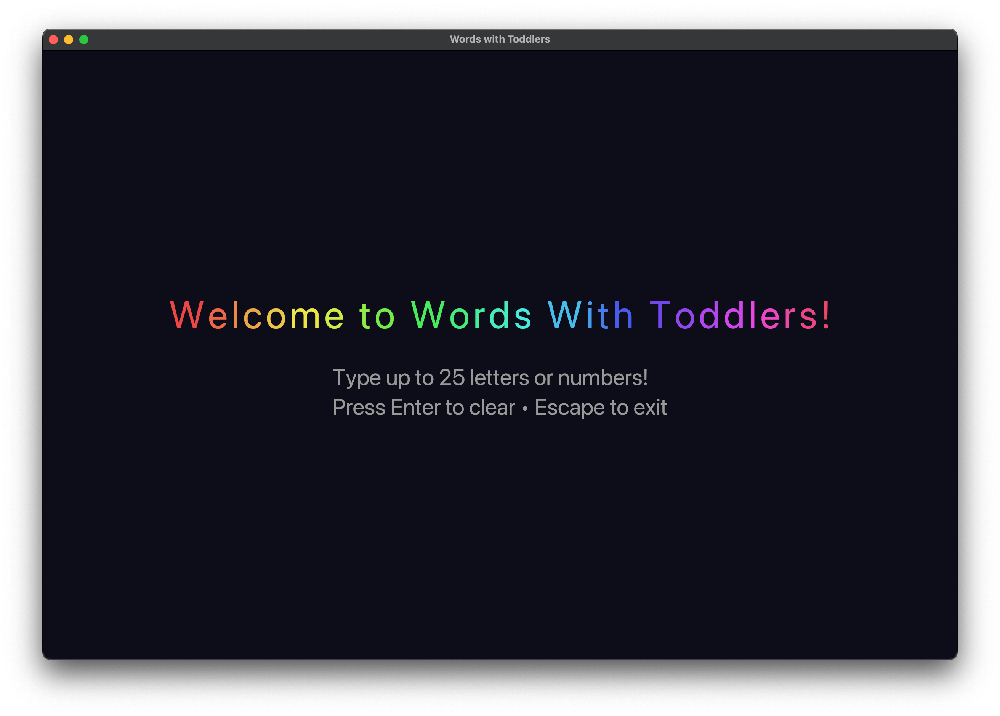

# 🌈 <span style="color:#FF6B6B">W</span><span style="color:#4ECDC4">o</span><span style="color:#45B7D1">r</span><span style="color:#96CEB4">d</span><span style="color:#FFEAA7">s</span> <span style="color:#DDA0DD">W</span><span style="color:#98D8C8">i</span><span style="color:#F7DC6F">t</span><span style="color:#85C1E2">h</span> <span style="color:#F8B739">T</span><span style="color:#52B788">o</span><span style="color:#E76F51">d</span><span style="color:#A8DADC">d</span><span style="color:#F1FA8C">l</span><span style="color:#FFB6C1">e</span><span style="color:#87CEEB">r</span><span style="color:#DDA0DD">s</span><span style="color:#98FB98">!</span> 🎨

A fun, colorful, and toddler-safe typing application built with Rust and Iced GUI framework. Perfect for introducing young children to letters and numbers on the keyboard!



## ✨ Features

- 🔤 **Large, Colorful Letters**: Each typed character appears in huge, randomly colored text
- 🔢 **Letters & Numbers**: Supports both alphabetic characters and numbers 0-9
- 🌈 **Rainbow Welcome Screen**: Engaging multicolored title to capture toddlers' attention
- 📏 **Dynamic Sizing**: Text automatically resizes based on the number of characters (up to 25)
- 🔒 **Toddler-Safe**:
  - Escape key to exit (harder for toddlers to accidentally press)
  - Window stays always-on-top
  - Maximizable window for full immersion
- 🧹 **Easy Clear**: Press Enter to clear all letters and start fresh
- ⌫ **Backspace Support**: Remove the last typed character

## 🚀 Installation

### Prerequisites
- Rust (1.70 or later)
- Cargo

### Build from Source

```bash
# Clone the repository
git clone https://github.com/yourusername/words-with-toddlers.git
cd words-with-toddlers

# Build in release mode for best performance
cargo build --release

# Run the application
cargo run --release
```

## 🎮 Usage

1. **Launch the app**: Run `cargo run --release`
2. **Type letters or numbers**: They appear in large, colorful text
3. **Press Enter**: Clear all text
4. **Press Backspace**: Remove last character
5. **Press Escape**: Exit the application

### Text Size Scaling
The app intelligently scales text size based on character count:
- 1-3 characters: Huge (300px)
- 4-6 characters: Very Large (200px)
- 7-10 characters: Large (150px)
- 11-15 characters: Medium (100px)
- 16-20 characters: Small (80px)
- 21-25 characters: Compact (60px)

## 🔐 Toddler Safety Tips

### macOS Guided Access (Recommended)
For the safest toddler experience on macOS:

1. Go to **System Settings → Accessibility → Guided Access**
2. Enable Guided Access and set a passcode
3. Launch Words with Toddlers
4. Triple-click the Touch ID/power button to activate Guided Access
5. The Mac is now locked to just this app until you triple-click and enter the passcode

### Additional Safety Features
- Window stays **always-on-top** to prevent accidental app switching
- Only **Escape** key exits (harder for toddlers to find)
- No external links or dangerous actions

## 🏗️ Project Structure

```
words-with-toddlers/
├── src/
│   ├── main.rs          # Application entry point
│   ├── app.rs           # Main application logic
│   ├── letter.rs        # Letter struct definition
│   ├── message.rs       # Message handling
│   └── utils/
│       ├── mod.rs       # Utils module
│       └── color.rs     # Color conversion utilities
├── Cargo.toml           # Dependencies
└── README.md            # This file
```

## 🛠️ Technical Details

### Built With
- **[Rust](https://www.rust-lang.org/)** - Systems programming language
- **[Iced](https://github.com/iced-rs/iced)** - Cross-platform GUI library
- **[rand](https://crates.io/crates/rand)** - Random number generation for colors

### Architecture
The application follows a clean, modular architecture:
- **Separation of Concerns**: Each module handles a specific responsibility
- **Event-Driven**: Uses Iced's Elm-inspired architecture
- **Type Safety**: Leverages Rust's type system for reliability

## 🎨 Color Generation

Each letter gets a unique random color using HSL to RGB conversion:
- **Hue**: Random value between 0-360°
- **Saturation**: 80% for vibrant colors
- **Lightness**: 60% for good visibility on dark background

## 📝 License

This project is open source and available under the MIT License.

## 🤝 Contributing

Contributions are welcome! Feel free to:
- Report bugs
- Suggest new features
- Submit pull requests

## 👶 Perfect For

- Teaching toddlers letter recognition
- Number familiarity
- Keyboard awareness
- Color recognition
- Cause-and-effect learning
- Safe computer interaction

## 🙏 Acknowledgments

- Iced GUI framework developers
- Rust community
- Parents everywhere dealing with curious toddlers!

---

Made with ❤️ by [Mystic](https://wecodefire.com)
